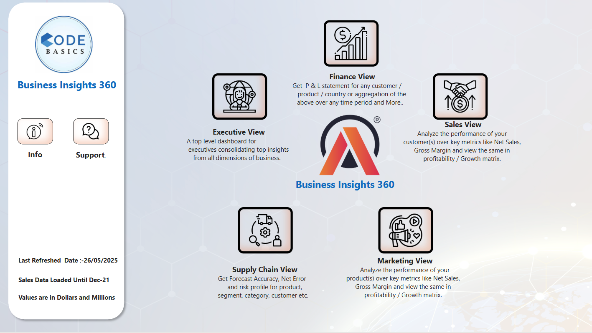

# Business-Insight-360
# 📊 Business Insights 360 - Power BI Project

A comprehensive Power BI project designed for **AtliQ Hardware** to provide actionable insights across Finance, Sales, Marketing, Supply Chain, and Executive verticals. Built with real business challenges and detailed data modeling, this project empowers decision-makers with deep analytics.

---

## 🏢 About AtliQ Hardware

AtliQ Hardware manufactures and sells hardware like PC, Mouse, Printers etc. to companies worldwide. Its customers include big names like Croma, Amazon, Neptune, Staples, Walmart, etc. These customers fall into two categories:

* **Physical Stores**
* **E-commerce Platforms**

---

## ⚠️ Problem Statement

AtliQ Hardware is struggling to do good business in **Latin America**. Until now, the company relied on surveys and intuition for decision-making. Earlier analysis was done using MS Excel due to limited data. Now that the company has grown and data is available, a Data Analyst has been hired to generate accurate, data-driven insights using Power BI.

---

## 📌 Management's Dashboard Requirements

The management wants to see these views in the Power BI dashboard:

* **Finance View** — Profit & Loss statements across products, markets, customers
* **Sales View** — Top-performing and bottom-performing customers with key metrics
* **Marketing View** — Product-based insights, gross/net profit, cost breakdowns
* **Supply Chain View** — Forecast accuracy, demand planning, inventory insights
* **Executive View** — Combined view with high-level KPIs

---

## 🛠️ Project Execution

**Step 1**: Loaded data into MySQL and connected with Power BI
**Step 2**: Removed default relationships and built dimension tables in Power Query
**Step 3**: Validated data against MySQL and Excel sources
**Step 4**: Performed data transformation (e.g. Last Sales Month Reference table)
**Step 5**: Created calculated columns like `fiscal_year` and merged relevant tables
**Step 6**: Data Modeling using **Star Schema**
**Step 7**: Created over **40+ DAX formulas** for calculated columns and validated them
**Step 8**: Optimized report to reduce size and improve performance

---

## 🏠 Dashboard Navigation

* The **Home Page** serves as the starting point for the dashboard.
* Each page is accessible via navigation buttons.
* Summary for each department is shown to help users navigate easily.

---

## 🔗 Dashboard & Video

* **🔗 Live Dashboard**: [Click to view](https://app.powerbi.com/view?r=eyJrIjoiOTg1Zjg1OGItYmZmNi00MDljLTlkMTQtNWM3YWRhYjRmOTA2IiwidCI6ImM2ZTU0OWIzLTVmNDUtNDAzMi1hYWU5LWQ0MjQ0ZGM1YjJjNCJ9)
* **📹 Project Video**: *(https://youtu.be/WOhVtDpu2E4)*
* **My Portfolio Web :- https://codebasics.io/portfolio/Nirbhay-kumar

---

## 📷 Dashboards & Their Purpose

### 🏠 Home Page


Provides navigation to all views and a summary of the dashboard's KPIs.

### 💰 Finance View


* Shows P\&L statements
* Highlights top/bottom products and customers
* Year-over-Year comparisons
* NS vs LY vs Target analysis for executive decisions

### 📈 Sales View


* Drilldown view by product and customer
* Regional analysis with filters
* Identifies strong and weak performing segments

### 📢 Marketing View


* Gross Margin %, Net Profit %, Operational Expenses
* Marketing budget optimization
* Shows business scope and growth opportunities per product/market

### 🚚 Supply Chain View


* Forecast accuracy by quarter
* Inventory cost & planning view
* Visual risk indicators (OOS vs EI)

### 🧑‍💼 Executive View


* Consolidated metrics (NS, GM%, NP%, RC%, Market Share)
* Top-performing customers and products
* One-page summary for leadership

---

## 🧰 Tools Used

* Microsoft Excel
* MySQL
* Power BI Desktop + Service
* DAX Studio

---

## 📚 Learnings

* End-to-end Power BI project design
* Hands-on with P\&L analysis
* Built Forecast %, Profit %, Margin % formulas
* Stakeholder-centric dashboard views
* Created Bookmarks, Tooltips, Dynamic Titles, and Conditional formatting

---

## 🔣 DAX Formulas Used (With Numbering)

```DAX
1. ABS Error = SUMX(DISTINCT(dim_date[date]), SUMX(DISTINCT(dim_product[product_code]), ABS([Net Error])))
2. ABS Error % = DIVIDE([ABS Error], [Forecast Qty], 0)
3. ABS Error LY = CALCULATE([ABS Error],SAMEPERIODLASTYEAR(dim_date[date]))
4. Ads & Promotions $ = SUM('fact_actuals_estimates'[ads_promotions])
5. Atliq MS % = CALCULATE([Market Share %], marketshare[manufacturer]="atliq")
6. BM Message = IF([NS BM $] = BLANK() || [GM % BM] = BLANK() || [NP % BM] = BLANK(), "BM Target is not available for the selected filters", "")
7. Customer / Product Filter Check = ISCROSSFILTERED(dim_product[product]) || ISFILTERED(dim_customer[customer])
8. Forecast Accuracy % = IF([ABS Error %]<>BLANK(), 1 — [ABS Error %], BLANK())
9. Forecast Accuracy % LY = CALCULATE([Forecast Accuracy %], SAMEPERIODLASTYEAR(dim_date[date]))
10. Forecast Qty = VAR lsalesdate = MAX(LastSalesMonth[LastSalesMonth]) RETURN CALCULATE(SUM(fact_forecast_monthly[forecast_quantity]), fact_forecast_monthly[date]<=lsalesdate)
11. Freight Cost $ = SUM(fact_actuals_estimates[Freight_cost])
12. GS $ = SUM(fact_actuals_estimates[gross_sales_amount])
13. Last Sales Month Home = "Sales Data Loaded Until : " & FORMAT(MAX(LastSalesMonth[LastSalesMonth]), "MMM YY")
14. Manufacturing Cost $ = SUM(fact_actuals_estimates[manufacturing_cost])
15. Market Share % = DIVIDE(SUM(marketshare[sales_$]),SUM(marketshare[total_market_sales_$]), 0)
16. Net Error = [Forecast Qty]-[Sales Qty]
17. Net Error % = DIVIDE([Net Error],[Forecast Qty],0)
18. Net Error LY = CALCULATE([Net Error],SAMEPERIODLASTYEAR(dim_date[date]))
19. Net Profit % = DIVIDE([Net Profit $],[NS $],0)
20. Net Profit % LY = CALCULATE([Net Profit %], SAMEPERIODLASTYEAR(dim_date[date]))
21. Net Profit $ = [GM $]+[Operational Expense $]
22. NIS $ = SUM(fact_actuals_estimates[net_invoice_sales_amount])
23. NP % BM = SWITCH(TRUE(), SELECTEDVALUE('Set BM'[ID])=1, [Net Profit % LY], SELECTEDVALUE('Set BM'[ID])=2, [NP Target %])
24. NP Target % = DIVIDE([NP Target $], SUM(NsGmTarget[np_target]), 0)
25. NP Target $ = SUM(NsGmTarget[np_target])
26. NS $ = SUM(fact_actuals_estimates[net_sales_amount])
27. NS $ LY = CALCULATE([NS $], SAMEPERIODLASTYEAR(dim_date[date]))
28. NS BM $ = SWITCH(TRUE(), SELECTEDVALUE('Set BM'[ID])=1,[NS $ LY], SELECTEDVALUE('Set BM'[ID])=2,[NS Target $])
29. NS Target $ = VAR tgt = SUM(NsGmTarget[ns_target]) RETURN IF([Customer / Product Filter Check], BLANK(), tgt)
30. Operational Expense $ = ([Ads & Promotions $]+[Other Operational Expense $])*-1
31. Other Cost $ = SUM(fact_actuals_estimates[other_cost])
32. Other Operational Expense $ = SUM('fact_actuals_estimates'[other_operational_expense])
33. Performance Visual Title = [Selected P & L Row] & " Performance Over Time"
34. Post Invoice Deduction $ = SUM(fact_actuals_estimates[post_invoice_deductions_amount])
35. Post Invoice Other Deduction $ = SUM(fact_actuals_estimates[post_invoice_other_deductions_amount])
36. Pre Invoice Deduction $ = [GS $] — [NIS $]
37. Quantity = SUM(fact_actuals_estimates[Qty])
38. RC % = DIVIDE([NS $],CALCULATE([NS $],ALL(dim_market), ALL(dim_customer), ALL(dim_product)))
39. Risk = IF([Net Error]>0,"EI", IF([Net Error]<0, "OOS", BLANK()))
40. Sales Qty = CALCULATE([Quantity], fact_actuals_estimates[date]<=MAX(LastSalesMonth[LastSalesMonth]))
41. Sales Trend Title = "NS & GM % For " & SELECTEDVALUE(dim_customer[customer])
42. Selected P & L Row = IF(HASONEVALUE('P & L Rows'[Description]), SELECTEDVALUE('P & L Rows'[Description]), "Net Sales")
43. Top / Bottom N Title = "Top / Bottom Products & Customers By " & [Selected P & L Row]
44. Total COGS $ = [Freight Cost $] + [Manufacturing Cost $] + [Other Cost $]
45. Total Post Invoice Deduction = [Post Invoice Deduction $] + [Post Invoice Other Deduction $]
46. post_invoice_deductions_amount = VAR res = CALCULATE(MAX(post_invoice_deductions[discounts_pct]), RELATEDTABLE(post_invoice_deductions)) RETURN res*fact_actuals_estimates[net_invoice_sales_amount]
47. post_invoice_other_deductions_amount = VAR res = CALCULATE(MAX(post_invoice_deductions[other_deductions_pct]), RELATEDTABLE(post_invoice_deductions)) RETURN res*fact_actuals_estimates[net_invoice_sales_amount]
```

---

## 📬 Contact

**Name**: Nirbhay Kumar
📧 [nirbhaykkr6@gmail.com](mailto:nirbhaykkr6@gmail.com)

---

**Date Updated**: 26 May 2025
**Currency**: USD (Millions)

